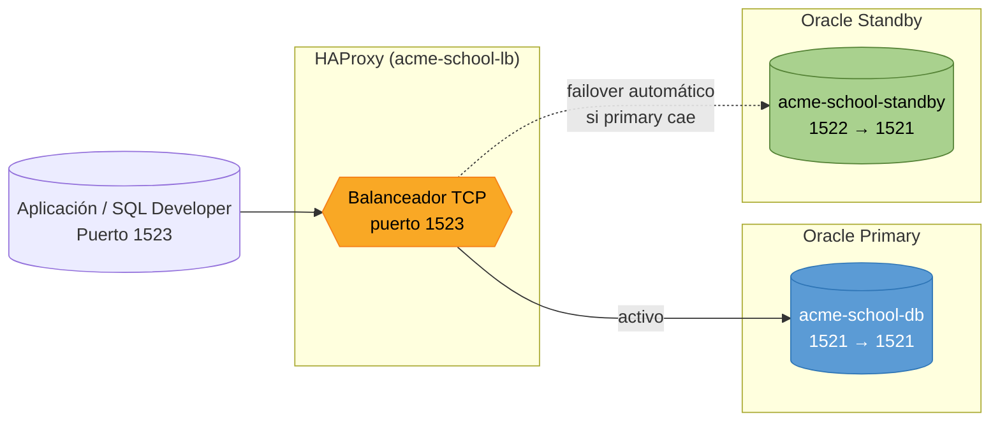

# Diagrama del Balanceador de Carga (HAProxy)

## Arquitectura



## Puertos

| Servicio | Puerto externo | Puerto interno | Rol |
|----------|---------------|----------------|-----|
| `acme-school-db` | 1521 | 1521 | Primary (activo) |
| `acme-school-standby` | 1522 | 1521 | Standby (backup) |
| `acme-school-lb` (HAProxy) | 1523 | 1523 | Balanceador TCP |

## Comportamiento

- La aplicación se conecta al **puerto 1523** (HAProxy).
- HAProxy enruta todo el tráfico al **primary** (1521).
- Si el primary no responde tras 3 health checks fallidos (15s), HAProxy
  redirige automáticamente al **standby** (1522).
- Cuando el primary vuelve a estar healthy, HAProxy lo reactiva como destino
  principal.

## Conexión vía balanceador

```
Host: IP_SERVIDOR
Port: 1523
Service: FREEPDB1
User: acme_school
Password: AcmeSchool2025
```

## Levantar

```bash
cd database
docker compose up -d
```

Los tres contenedores arrancan: primary, standby y HAProxy.
