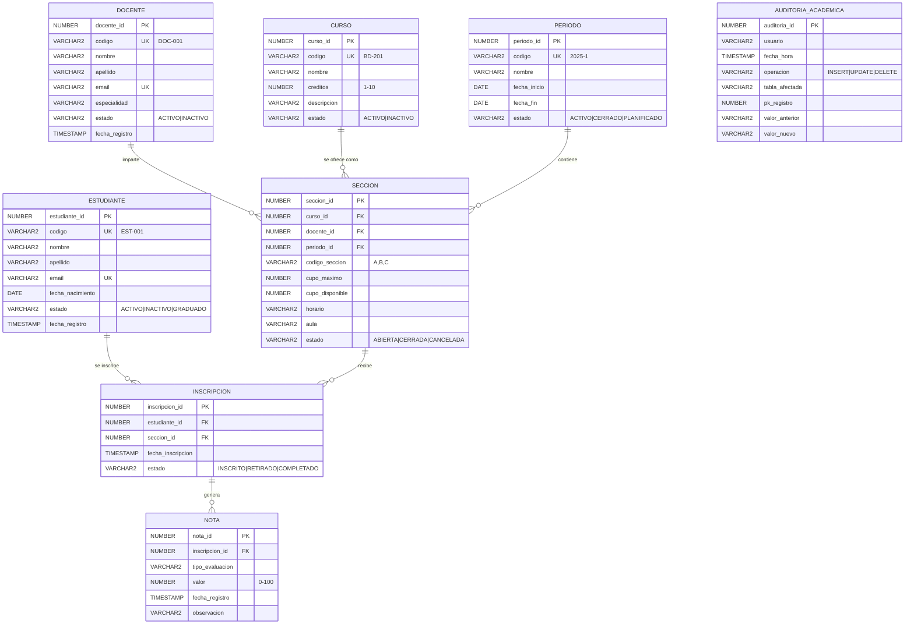

# Diagrama Entidad-Relación - Modelo Operacional

## Diagrama ER



## Cardinalidades

| Relación | Cardinalidad | Descripción |
|----------|--------------|-------------|
| ESTUDIANTE → INSCRIPCION | 1:N | Un estudiante puede tener muchas inscripciones |
| DOCENTE → SECCION | 1:N | Un docente imparte varias secciones |
| CURSO → SECCION | 1:N | Un curso puede tener varias secciones (A, B, C...) |
| PERIODO → SECCION | 1:N | Un período contiene muchas secciones |
| SECCION → INSCRIPCION | 1:N | Una sección recibe muchas inscripciones (limitado por cupo_maximo) |
| INSCRIPCION → NOTA | 1:N | Una inscripción genera varias notas (parciales, final, etc.) |

## Reglas de Integridad

1. **PK**: Todas las entidades tienen PK numérica generada por secuencia
2. **FK**: Todas las relaciones tienen FK con `REFERENCES`
3. **UNIQUE**:
   - `estudiante.codigo`, `estudiante.email`
   - `docente.codigo`, `docente.email`
   - `curso.codigo`
   - `periodo.codigo`
   - `seccion(curso_id, periodo_id, codigo_seccion)` — no duplicar secciones
   - `inscripcion(estudiante_id, seccion_id)` — un estudiante no se inscribe dos veces
4. **CHECK**:
   - `estudiante.estado IN ('ACTIVO','INACTIVO','GRADUADO')`
   - `docente.estado IN ('ACTIVO','INACTIVO')`
   - `curso.creditos BETWEEN 1 AND 10`
   - `periodo.fecha_fin > fecha_inicio`
   - `seccion.cupo_disponible >= 0` y `<= cupo_maximo`
   - `inscripcion.estado IN ('INSCRITO','RETIRADO','COMPLETADO')`
   - `nota.valor BETWEEN 0 AND 100`

## Flujo Principal de Negocio

```
1. Admin crea CURSO + PERIODO
2. Admin crea SECCION (curso + docente + periodo + cupo)
3. ESTUDIANTE se INSCRIBE en SECCION
   → cupo_disponible disminuye
4. DOCENTE registra NOTA por inscripción
5. Sistema calcula promedio y estado de aprobación
6. Período se CIERRA al finalizar
   → inscripciones pasan a COMPLETADO
```
