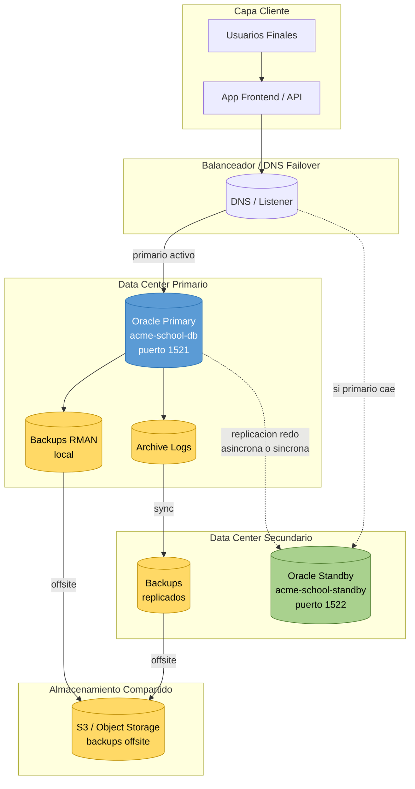

# Arquitectura de Alta Disponibilidad

## Tarea: T-045 | Responsable: Luis

## Contexto

Oracle Database Free (la edición que usamos) **no soporta Data Guard ni RAC** de forma nativa. Sin embargo, el requerimiento de Alta Disponibilidad se cumple presentando:

1. Un **diseño conceptual** de la arquitectura HA ideal
2. Una **simulación práctica** de failover usando dos contenedores Docker

## Diagrama de Arquitectura



## Componentes

### Capa de aplicación
- **Frontend / API**: Apunta al listener Oracle. En caso de failover, el listener redirige automáticamente al standby promovido.
- **Backend**: Usa connection string con múltiples direcciones (`failover=on`).

### Base de datos primaria
- Oracle Database Free 23ai en contenedor `acme-school-db`
- Puerto 1521
- Volumen persistente con datos
- Modo ARCHIVELOG activo (T-026)
- Backups RMAN diarios e incrementales (T-025)

### Base de datos standby (simulada)
- Contenedor `acme-school-standby` en puerto 1522
- En producción real sería **Data Guard Physical Standby**
- Recibe redo logs del primario
- En modo READ ONLY (consultas) o aplicando logs (catch-up)

### Almacenamiento offsite
- Backups replicados a S3 u otro storage externo
- Protección ante pérdida total del data center primario

## Flujo de failover

```
1. Aplicación detecta caída del primario
   ↓
2. DNS / Listener redirige al standby
   ↓
3. Standby se promueve a nuevo primario
   ↓
4. Aplicación retoma operación normal
   ↓
5. Equipo investiga falla del primario original
   ↓
6. Una vez resuelto, primario original se reincorpora
   como nuevo standby (rebuild si fuera necesario)
```

## Limitaciones de la edición Free

Oracle Database Free no permite:
- Data Guard nativo
- RAC (Real Application Clusters)
- GoldenGate
- Active Data Guard

Por eso la implementación práctica (T-047) usa **Data Pump + segundo contenedor** como simulación funcional. Para producción real, las opciones son:

| Opción | Costo | Complejidad |
|--------|-------|-------------|
| Oracle Standard Edition + Data Guard | Licencia | Media |
| Oracle Enterprise Edition + Data Guard | Licencia alta | Alta |
| Oracle Cloud (DBCS / Autonomous) | Por uso | Baja |
| PostgreSQL Streaming Replication | Free | Media |

## Implementación práctica

La simulación de failover está documentada en `ha/02_failover_simulacion.sql`. Métricas reales (RPO/RTO) en `ha/03_rpo_rto.md` (T-046).

## Decisiones de diseño

1. **Async vs Sync replication**: Para esta demo se asume async (más realista en contenedores Docker locales). RPO ≠ 0 pero acceptable.
2. **Failover manual vs automático**: Manual en la demo (más simple de mostrar). En producción se usaría Observer (Data Guard Broker) para detección automática.
3. **Read-only en standby**: Permitido para descargar consultas analíticas del primario.
